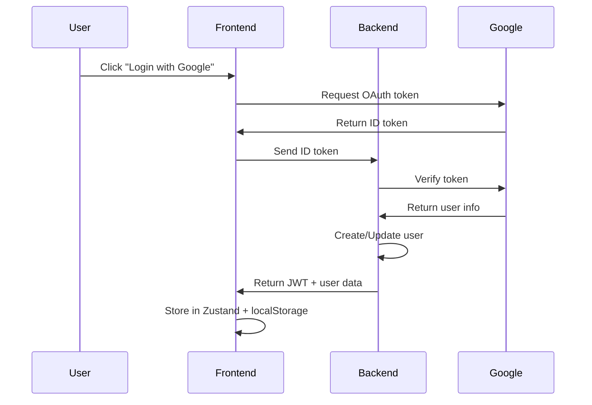

# 🎯 Lakshya - AI-Powered Career Guidance Platform

**Lakshya** is a comprehensive career guidance platform that combines interactive assessments, AI-powered recommendations, and extensive educational resource discovery to help students make informed decisions about their academic and career paths.

## 🌟 Overview

Lakshya addresses the critical challenge of career confusion among students by providing:
- **Personalized Career Assessments** for different educational streams
- **AI-Powered Recommendations** using Google Gemini AI
- **Comprehensive College & Course Database** with 3000+ institutions
- **Interactive User Experience** with modern, responsive design
- **Secure Authentication** with Google OAuth integration

## 🚀 Live Demo

- **Frontend**: [http://localhost:5173](http://localhost:5173)
- **Backend API**: [http://localhost:8080/api](http://localhost:8080/api)

## 📋 Table of Contents

- [Features](#-features)
- [Technology Stack](#-technology-stack)
- [Project Structure](#-project-structure)
- [Getting Started](#-getting-started)
- [API Documentation](#-api-documentation)
- [Database Schema](#-database-schema)
- [Authentication Flow](#-authentication-flow)
- [Contributing](#-contributing)
- [License](#-license)

## ✨ Features

### 🎓 **Career Assessment System**
- **Stream-Specific Quizzes**: Tailored assessments for PCM, PCB, Commerce, and Arts streams
- **Class 10 Stream Selection**: Helps students choose the right stream after 10th grade
- **Class 12 Field Recommendation**: Provides career field suggestions based on chosen stream
- **Interactive Quiz Interface**: Engaging UI with progress tracking and detailed explanations

### 🏛️ **Educational Resource Discovery**
- **College Explorer**: Browse 3000+ colleges with advanced filtering
- **Course Catalog**: Comprehensive course database with detailed information
- **Exam Information**: Entrance exam details and preparation resources
- **Smart Search**: AI-powered search with filters by location, fees, ratings, and more

### 👤 **User Management**
- **Google OAuth Authentication**: Secure, one-click login with Google
- **Profile Completion**: Guided profile setup for personalized experience
- **Dashboard**: Centralized view of bookmarked items and user progress
- **Bookmark System**: Save and organize favorite colleges, courses, and exams

### 🤖 **AI Integration**
- **Google Gemini AI**: Powers intelligent course and career recommendations
- **Personalized Suggestions**: AI analyzes user preferences and quiz results
- **Smart Content Generation**: Dynamic content creation for user guidance

### 📱 **Modern User Experience**
- **Responsive Design**: Mobile-first approach with seamless device compatibility
- **Dark/Light Theme**: Customizable appearance preferences
- **Loading States**: Comprehensive feedback during async operations
- **Error Handling**: User-friendly error messages and recovery options

## 🛠️ Technology Stack

### **Frontend**
- **React 18** - Modern UI library with hooks
- **Vite** - Fast build tool and development server
- **Tailwind CSS** - Utility-first CSS framework
- **Shadcn/UI** - High-quality React components
- **Zustand** - Lightweight state management
- **React Router** - Client-side routing
- **React Hook Form** - Form management with validation
- **Zod** - TypeScript-first schema validation
- **Axios** - HTTP client for API communication
- **FontAwesome** - Comprehensive icon library

### **Backend**
- **Node.js** - JavaScript runtime environment
- **Express.js** - Web application framework
- **MongoDB** - NoSQL database
- **Mongoose** - MongoDB object modeling
- **JWT** - Secure authentication tokens
- **Google OAuth2** - Third-party authentication
- **Google Gemini AI** - AI-powered recommendations
- **bcryptjs** - Password hashing
- **CORS** - Cross-origin resource sharing
- **Zod** - Request validation

### **Development Tools**
- **ESLint** - Code linting and formatting
- **Nodemon** - Development server auto-restart
- **dotenv** - Environment variable management

## 📁 Project Structure

```
Lakshya/
├── 📁 backend/                    # Node.js Express API
│   ├── 📁 controllers/           # Request handlers
│   │   ├── authController.js     # Authentication logic
│   │   ├── quizController.js     # Quiz management
│   │   ├── collegeController.js  # College data handling
│   │   ├── courseController.js   # Course information
│   │   ├── examController.js     # Exam details
│   │   └── bookmarkController.js # User bookmarks
│   ├── 📁 models/                # Database schemas
│   │   ├── User.js              # User profile model
│   │   ├── College.js           # College information
│   │   ├── Course.js            # Course details
│   │   ├── Exam.js              # Exam information
│   │   └── Quiz.js              # Quiz structure
│   ├── 📁 routes/                # API endpoints
│   │   ├── authRoutes.js        # Authentication routes
│   │   ├── quizRoutes.js        # Quiz endpoints
│   │   ├── collegeRoutes.js     # College API
│   │   ├── courseRoutes.js      # Course API
│   │   ├── examRoutes.js        # Exam API
│   │   └── bookmarkRoutes.js    # Bookmark management
│   ├── 📁 services/              # Business logic
│   │   ├── authService.js       # Authentication service
│   │   ├── quizService.js       # Quiz logic
│   │   ├── collegeService.js    # College operations
│   │   ├── aiCourseService.js   # AI recommendations
│   │   └── geminiService.js     # Google Gemini integration
│   ├── 📁 utils/                 # Utility functions
│   │   ├── 📁 auth/             # Authentication utilities
│   │   ├── 📁 database/         # Database connection
│   │   ├── 📁 errors/           # Error handling
│   │   ├── 📁 middleware/       # Express middleware
│   │   └── 📁 validation/       # Input validation
│   ├── 📁 init/                  # Database initialization
│   │   ├── colleges.js          # College data seeding
│   │   ├── courses.js           # Course data seeding
│   │   └── 📁 quizzes/          # Quiz data initialization
│   ├── app.js                   # Express application setup
│   ├── package.json             # Backend dependencies
│   └── .env                     # Environment variables
│
├── 📁 frontend/                   # React Application
│   ├── 📁 src/
│   │   ├── 📁 modules/           # Feature-based architecture
│   │   │   ├── 📁 user/         # Authentication & Profile
│   │   │   │   ├── 📁 api/      # Auth API calls
│   │   │   │   ├── 📁 components/ # User components
│   │   │   │   ├── 📁 pages/    # Login, SignUp, Profile
│   │   │   │   ├── 📁 store/    # User state management
│   │   │   │   └── 📁 validation/ # Form validation
│   │   │   ├── 📁 quiz/         # Quiz Assessment System
│   │   │   │   ├── 📁 components/ # Quiz components
│   │   │   │   └── 📁 pages/    # Quiz pages
│   │   │   ├── 📁 courses/      # Course Discovery
│   │   │   ├── 📁 colleges/     # College Explorer
│   │   │   ├── 📁 exams/        # Exam Information
│   │   │   └── 📁 home/         # Landing Page
│   │   ├── 📁 shared/           # Shared Resources
│   │   │   ├── 📁 components/   # Reusable components
│   │   │   ├── 📁 layouts/      # Page layouts
│   │   │   └── 📁 routes/       # Router configuration
│   │   ├── 📁 components/       # UI Components (Shadcn)
│   │   ├── 📁 services/         # API services
│   │   └── 📁 assets/           # Static assets
│   ├── package.json             # Frontend dependencies
│   ├── vite.config.js           # Vite configuration
│   ├── tailwind.config.js       # Tailwind CSS config
│   └── .env                     # Environment variables
│
├── 📄 colleges.json              # College database
├── 📄 courses.json               # Course database
├── 📄 exams.json                 # Exam database
└── 📄 README.md                  # Project documentation
```

## 🚦 Getting Started

### Prerequisites

- **Node.js** (v18 or higher)
- **npm** or **yarn**
- **MongoDB** (local or cloud instance)
- **Google OAuth2** credentials
- **Google Gemini AI** API key

### Installation

1. **Clone the repository**
   ```bash
   git clone https://github.com/meetbatra/Lakshya.git
   cd Lakshya
   ```

2. **Backend Setup**
   ```bash
   cd backend
   npm install
   ```

   Create `.env` file in backend directory:
   ```env
   # Database
   MONGODB_URI=mongodb://localhost:27017/lakshya
   
   # Authentication
   JWT_SECRET=your-super-secret-jwt-key
   JWT_EXPIRES_IN=7d
   
   # Google OAuth
   GOOGLE_CLIENT_ID=your-google-client-id
   GOOGLE_CLIENT_SECRET=your-google-client-secret
   
   # Google Gemini AI
   GEMINI_API_KEY=your-gemini-api-key
   
   # Server
   PORT=8080
   NODE_ENV=development
   ```

3. **Frontend Setup**
   ```bash
   cd ../frontend
   npm install
   ```

   Create `.env` file in frontend directory:
   ```env
   # API Configuration
   VITE_API_URL=http://localhost:8080/api
   
   # Google OAuth
   VITE_GOOGLE_CLIENT_ID=your-google-client-id
   ```

4. **Initialize Database** (Optional)
   ```bash
   cd ../backend
   node init/index.js
   ```

5. **Start Development Servers**

   **Backend:**
   ```bash
   cd backend
   npm run dev
   ```

   **Frontend:**
   ```bash
   cd frontend
   npm run dev
   ```

6. **Access the Application**
   - Frontend: [http://localhost:5173](http://localhost:5173)
   - Backend API: [http://localhost:8080/api](http://localhost:8080/api)

## 📚 API Documentation

### Authentication Endpoints

```http
POST /api/auth/register          # User registration
POST /api/auth/login             # User login
POST /api/auth/google            # Google OAuth login
GET  /api/auth/profile           # Get user profile
PUT  /api/auth/profile           # Update user profile
POST /api/auth/logout            # User logout
```

### Quiz Endpoints

```http
GET  /api/quiz/available/:class  # Get available quizzes
GET  /api/quiz/class10           # Class 10 stream selection quiz
POST /api/quiz/class10/submit    # Submit Class 10 quiz
GET  /api/quiz/class12/pcm       # Class 12 PCM field quiz
POST /api/quiz/class12/pcm/submit # Submit PCM quiz
GET  /api/quiz/class12/pcb       # Class 12 PCB field quiz
GET  /api/quiz/class12/commerce  # Class 12 Commerce quiz
GET  /api/quiz/class12/arts      # Class 12 Arts quiz
```

### Educational Resource Endpoints

```http
# Colleges
GET  /api/colleges               # Get colleges with filters
GET  /api/colleges/:id           # Get college details
GET  /api/colleges/stats         # Get college statistics
GET  /api/colleges/filters       # Get filter options

# Courses
GET  /api/courses                # Get courses with filters
GET  /api/courses/:id            # Get course details
GET  /api/courses/stats          # Get course statistics
GET  /api/courses/recommendations # AI-powered recommendations

# Exams
GET  /api/exams                  # Get exams with filters
GET  /api/exams/:id              # Get exam details
GET  /api/exams/stats            # Get exam statistics
```

### Bookmark Endpoints

```http
POST /api/bookmarks/add          # Add bookmark
POST /api/bookmarks/remove       # Remove bookmark
GET  /api/bookmarks              # Get user bookmarks
GET  /api/bookmarks/check/:type/:id # Check if bookmarked
GET  /api/bookmarks/counts       # Get bookmark counts
```

## 🗄️ Database Schema

### User Model
```javascript
{
  name: String,
  email: String (unique),
  password: String (hashed),
  googleId: String,
  avatar: String,
  class: String,
  state: String,
  stream: String,
  field: String,
  bookmarks: {
    courses: [ObjectId],
    colleges: [ObjectId],
    exams: [ObjectId]
  },
  preferences: {
    interestedStreams: [String],
    careerGoals: [String],
    studyPreference: String
  },
  createdAt: Date,
  updatedAt: Date
}
```

### College Model
```javascript
{
  name: String,
  type: String,
  state: String,
  city: String,
  established: Number,
  affiliation: String,
  courses: [String],
  fees: {
    undergraduate: Number,
    postgraduate: Number
  },
  ratings: {
    overall: Number,
    academics: Number,
    placements: Number,
    infrastructure: Number
  },
  facilities: [String],
  contact: {
    website: String,
    phone: String,
    email: String
  }
}
```

### Quiz Model
```javascript
{
  title: String,
  description: String,
  targetClass: String,
  targetStream: String,
  questions: [{
    question: String,
    options: [String],
    correctAnswer: Number,
    explanation: String,
    category: String
  }],
  scoring: {
    categories: [String],
    recommendations: Map
  },
  metadata: {
    duration: Number,
    difficulty: String,
    totalQuestions: Number
  }
}
```

## 🔐 Authentication Flow

### 1. **Google OAuth Flow**


### 2. **JWT Token Management**
- **Access Token**: Stored in Zustand store and localStorage
- **Automatic Refresh**: Handled by Axios interceptors
- **Token Expiry**: Automatic logout on 401 responses
- **Security**: Tokens include user ID and expiration time

### 3. **Protected Routes**
- **Frontend**: Route-based protection using React Router
- **Backend**: Middleware-based authentication for API endpoints
- **State Persistence**: User state persists across browser sessions

## 🎨 UI/UX Features

### **Responsive Design**
- **Mobile-First**: Optimized for mobile devices
- **Breakpoints**: Tailwind CSS responsive utilities
- **Touch-Friendly**: Large tap targets and gesture support

### **Loading States**
- **Skeleton Loaders**: Content placeholders during loading
- **Progress Indicators**: Quiz progress and form submission states
- **Spinner Animations**: API call feedback

### **Error Handling**
- **Toast Notifications**: Success and error messages
- **Form Validation**: Real-time input validation with Zod
- **Fallback UI**: Graceful error recovery

### **Accessibility**
- **Keyboard Navigation**: Full keyboard support
- **Screen Reader**: ARIA labels and semantic HTML
- **Color Contrast**: WCAG compliant color schemes

## 🤖 AI Integration

### **Google Gemini AI Features**
- **Course Recommendations**: Personalized based on user profile and quiz results
- **Career Path Suggestions**: AI-generated career roadmaps
- **Content Generation**: Dynamic quiz explanations and guidance
- **Smart Search**: Natural language processing for educational resource discovery

### **AI Service Architecture**
```javascript
// AI Course Service
const getPersonalizedRecommendations = async (userProfile, quizResults) => {
  const prompt = generatePrompt(userProfile, quizResults);
  const recommendations = await geminiService.generateContent(prompt);
  return parseRecommendations(recommendations);
};
```

## 🔧 Development Guidelines

### **Code Organization**
- **Modular Architecture**: Feature-based module organization
- **Separation of Concerns**: Clear separation between UI, logic, and data
- **Component Reusability**: Shared components in `shared/` directory
- **API Layer**: Centralized API calls with error handling

### **State Management**
- **Zustand Stores**: Lightweight state management for each module
- **Local State**: Component-level state for UI interactions
- **Persistent State**: User authentication and preferences in localStorage

### **Error Handling**
- **Backend**: Centralized error handling with `wrapAsync` middleware
- **Frontend**: Try-catch blocks with user-friendly error messages
- **Validation**: Input validation on both client and server sides

## 🚀 Deployment

### **Frontend Deployment**
```bash
cd frontend
npm run build
# Deploy dist/ folder to your hosting service
```

### **Backend Deployment**
```bash
cd backend
# Set production environment variables
NODE_ENV=production
# Deploy to your server (Heroku, AWS, DigitalOcean, etc.)
```

### **Environment Configuration**
- **Development**: Local MongoDB and development API keys
- **Production**: Cloud MongoDB (MongoDB Atlas) and production credentials
- **Security**: Use environment variables for all sensitive data

## 📈 Performance Optimizations

### **Frontend**
- **Code Splitting**: Lazy loading of route components
- **Image Optimization**: Optimized images and lazy loading
- **Bundle Size**: Tree shaking and dynamic imports
- **Caching**: Service worker for offline functionality

### **Backend**
- **Database Indexing**: Optimized queries with proper indexes
- **Response Compression**: Gzip compression for API responses
- **Rate Limiting**: API rate limiting to prevent abuse
- **Caching**: Redis for frequently accessed data

## 🧪 Testing

### **Frontend Testing**
```bash
cd frontend
npm run test
```

### **Backend Testing**
```bash
cd backend
npm run test
```

### **Test Coverage**
- **Unit Tests**: Component and function testing
- **Integration Tests**: API endpoint testing
- **E2E Tests**: Full user journey testing

## 🤝 Contributing

1. **Fork the repository**
2. **Create a feature branch**: `git checkout -b feature/amazing-feature`
3. **Commit changes**: `git commit -m 'Add amazing feature'`
4. **Push to branch**: `git push origin feature/amazing-feature`
5. **Open a Pull Request**

### **Development Setup**
- Follow the installation guide above
- Use conventional commit messages
- Ensure all tests pass before submitting PR
- Update documentation for new features

## 📄 License

This project is licensed under the MIT License - see the [LICENSE](LICENSE) file for details.

## 👥 Team

- **Meet Batra** - Full Stack Developer - [GitHub](https://github.com/meetbatra)

## 🙏 Acknowledgments

- **Google OAuth2** for secure authentication
- **Google Gemini AI** for intelligent recommendations
- **Shadcn/UI** for beautiful React components
- **Tailwind CSS** for utility-first styling
- **React Community** for excellent libraries and tools

## 📞 Support

For support, email your-email@example.com or open an issue on GitHub.

---

**Built with ❤️ for students seeking clarity in their career journey**

---

## 📊 Project Statistics

- **Total Files**: 150+ source files
- **Lines of Code**: 15,000+ lines
- **Components**: 50+ React components
- **API Endpoints**: 25+ RESTful endpoints
- **Database Models**: 5 comprehensive schemas
- **College Database**: 3,000+ institutions
- **Quiz Questions**: 100+ assessment questions
- **Supported Streams**: PCM, PCB, Commerce, Arts
- **Authentication**: Google OAuth + JWT
- **AI Integration**: Google Gemini AI
- **Responsive Design**: Mobile-first approach
- **State Management**: Zustand stores
- **Form Validation**: Zod schemas
- **Error Handling**: Centralized with middleware